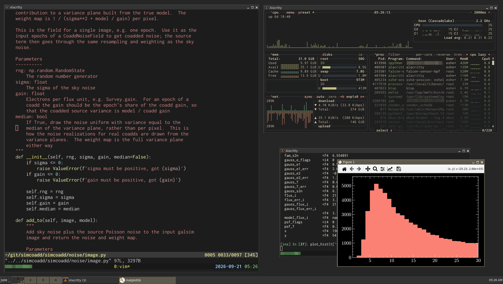

# rdesk — a remote desktop that needs no root

A persistent desktop on a remote host, reached over SSH from your own machine,
in the spirit of ThinLinc. Nothing is installed system-wide and nothing runs as
root: you unpack a directory in your home and start a session as yourself.

The remote side is a single bundle of statically linked programs, so it does not
care how old the host is, which libraries it has, or what your login environment
sets. It runs on anything x86_64 with a Linux kernel — a CentOS 7 host with no X
libraries and no fonts works fine.

    your machine                        remote host
    ┌───────────┐    ssh tunnel    ┌──────────────────────────┐
    │ vncviewer │◀─── socket ─────▶│  Xvnc ── jwm ── apps     │
    └───────────┘                  └──────────────────────────┘

Closing the viewer leaves everything running; connect again and your windows are
where you left them.




## What is here

| File | What it is |
|---|---|
| `rdesk` | the command you run on your own machine |
| `rdesk-session` | runs on the host to start, stop and report on a session |
| `jwm.rdesk` | the window manager configuration a session uses unless you have your own |
| `build/` | builds the bundle from source |

The bundle itself is not in the repository: build it with `build/build.sh`,
which writes `work/rdesk-static-x86_64.tar.gz`.

## Install on a host

```sh
# install the bundle
scp rdesk-static-x86_64.tar.gz host:
# on the host. Remove any existing install first
rm -rf ~/local/rdesk &&
tar xzf rdesk-static-x86_64.tar.gz -C ~/local
```

That gives `~/local/rdesk`, which is where `rdesk` looks by default. Any other
path works too — tell `rdesk` about it with `RDESK_REMOTE`. If your home
directory is shared between hosts, install it once and every host has it.

Use the same commands to update: the `rm -rf` matters, because unpacking over
an old bundle keeps files the new one no longer ships, and a stale font or
program can then shadow the new one. Removing the directory under a running
session is safe; the next `rdesk host stop` and reconnect picks up the new
programs.

## Use it

```sh
rdesk host          # connect, starting a session if none is running
rdesk host stop     # end the session
```

You need a VNC viewer on your own machine (`tigervnc-viewer` on most
distributions). Everything goes through one SSH connection, so you are asked for
a password or passphrase at most once.

There is one session per host. `rdesk host` reconnects to it as often as you
like; only `rdesk host stop` ends it. Connecting from a second machine takes
the session over: the first viewer is disconnected, the desktop carries on.


## Using the desktop

The window manager is [JWM](https://joewing.net/projects/jwm/). Its
configuration, `jwm.rdesk`, is JWM's stock one in the colours of the earlier
fvwm setup:

- a bar along the bottom: the `JWM` button opens the main menu and `_` shows
  the desktop; then the pager, four desks in a row (click one to go there, or
  drag a window within it to another desk); a button for each window (click to
  bring the window to the front, or to minimize it if it is already there);
  and a clock;
- focus follows the mouse, and a click in a window brings it to the front;
- the title bar has minimize, maximize and close buttons at the right and the
  window menu at the left; drag the title bar to move, a border to resize;
  double click the title bar to maximize, scroll over it to shade;
- left or middle click on the desktop background opens the main menu: a
  terminal (st), xterm, "Restart", which reloads the configuration, and
  "Exit".
  The scroll wheel there switches desks;
- keys: Alt+Tab cycles windows, Alt+F4 closes one, Alt+1 to Alt+4 and
  Alt+arrows switch desks, Alt+F1 opens the main menu, Alt+F2 the window
  menu, Alt+F10 maximizes, and holding Alt lets you drag a window from
  anywhere in it. The window manager on the machine you connect from may
  catch some of these first.

The desktop starts at 1920x1200 and follows your viewer window when you resize
or maximize it: JWM notices the new size itself, and the bar and maximized
windows follow.

"Exit" in the main menu asks for confirmation and then ends the session, as
`rdesk host stop` does.

To change any of this, start from the bundle's configuration:

```sh
cp ~/local/rdesk/share/jwm/jwm.rdesk ~/.jwmrc
```

A session uses `~/.jwmrc` (or `~/.config/jwm/jwmrc`) when you have one, and
`jwm.rdesk` otherwise; "Restart" reads it again. JWM's
[configuration reference](https://joewing.net/projects/jwm/config.html)
covers every setting. Besides the colours, `jwm.rdesk` differs from JWM's
stock configuration in two things: the menu offers the bundle's two
terminals, `st` and `xterm`, and the clock format is spelled `%I:%M %p`, since the
`%l` of the original shows nothing with the C library these programs are built
with.

The desktop background is grey15, set by JWM. JWM sets it each time it starts,
and it restarts itself whenever the desktop is resized, so a colour set with
`xsetroot` lasts only until the next resize. To manage the background yourself,
remove the `Background` tag from your copy of the configuration, or have JWM
run your command for it: `<Background type="command">xsetroot -solid
steelblue</Background>`.

## The terminals

The bundle carries two terminals, so a session has one even on a host
without any: [st](https://st.suckless.org/), small and fast, and
[xterm](https://invisible-island.net/xterm/), which has scrollback and a
`TERM` every host already knows. The main menu opens either; typing `st` or
`xterm` in one starts another.

### st

`st` keeps its settings in its source rather than a configuration file, so the
bundle's is built with JetBrains Mono at pixelsize 16 and a palette meant to
read on a dark background. That gives a 10x22 pixel cell, so an 80x24 window
is 804x532. The bundle carries the font's regular, bold, italic and bold
italic, so programs that ask for italic get the real face rather than a
slanted upright one. To try another font without rebuilding, run
`st -f 'DejaVu Sans Mono:pixelsize=16'`; to change the default, edit the
`st` section of `build/apps.sh` and build again.

`TERM` is `st-256color`, a terminal description few hosts have: the bundle
ships it and a session puts it first on `TERMINFO_DIRS`, ahead of the host's
own, so every other terminal the host knows still works. Over ssh to a host
that lacks it, programs fall back awkwardly; send it ahead once with
`infocmp -x | ssh otherhost tic -x -`, or use `TERM=xterm-256color ssh ...`
for the occasional login. `st` has no scrollback; run tmux in it, or use
xterm.

### xterm

`TERM` is `xterm-256color`, so ssh from it to anywhere just works. Its
settings are X resources: the bundle's defaults are Hack at 11 points and the
same colours as `st`, and anything in your `~/.Xdefaults`, or loaded with
`xrdb`, overrides them, for example

```
XTerm*faceSize: 13
XTerm*saveLines: 10000
```

It uses Hack rather than `st`'s JetBrains Mono only because its resources were
written that way; `XTerm*faceName: JetBrains Mono` changes it. Avoid
Inconsolata here: xterm sizes its cells by the widest glyph in the font, and
spaces Inconsolata 3 out too far (see [Settings](#settings)). Ctrl with the
left, middle or right button opens its menus.

The bundle's resources reach xterm through `XFILESEARCHPATH`, which a session
sets with the bundle's directory first and then the usual ones, so other X
programs find their own resource files as before. On a host with its own
`xterm`, the order of `PATH` decides which one runs; `which xterm` in a
terminal tells. Either way it reads the bundle's resources.

Other terminals on the host, such as alacritty, work as before. To have the
menu open one of them, change its `Program` line in your own copy of the
configuration.

## A PDF viewer and an image viewer

For hosts that lack them, the bundle can carry two programs of its own: `mupdf`,
a PDF viewer, and `feh`, an image viewer. They are left out unless the bundle
is built with them (see [Building the bundle](#building-the-bundle)), and are
then on the desktop's `PATH` like the rest of the bundle. On a host with its own
program of the same name, the order of `PATH` there decides which one runs;
`which feh` in a desktop terminal tells.

`mupdf` has no menus; everything is a key:

| Key | Does |
|---|---|
| `/`, `?` | search forwards, backwards; then `n`, `N` for the next and previous match |
| `r` | reload the file, after it has changed |
| space, `b` | next, previous page (also `.` and `,`, Page Down and Page Up) |
| `123g`, `G` | go to page 123, to the last page |
| `+`, `-`, `W`, `Z` | zoom in, out, to the window's width, to the whole page |
| `m`, `t` | mark this page, go back to the mark |
| `I` | invert colours |
| `q` | quit |

Drag with the right button to select text, for pasting with the middle button;
Ctrl+C then copies it to the clipboard as well. Click a link to follow it. A
script that rebuilds a document can have every `mupdf` showing it reload with
`pkill -HUP mupdf`. It does not reload on its own, and has no contents panel,
continuous scrolling or printing. Besides PDF it opens EPUB, XPS, CBZ and
images. The standard PDF fonts are built in, but not MuPDF's Noto and CJK fonts,
so a document that uses scripts such as Chinese without embedding its fonts
shows boxes for that text.

`feh` shows the images named on its command line, or every image in a
directory: space and Backspace (or the arrow keys, or a left click) go through
them, `m` or a right click opens a menu, `d` shows the file name and `q` quits.
`feh -t dir` shows thumbnails. An image that changes on disk is shown again.
It reads PNG, JPEG, GIF, WebP, BMP, PNM, TGA, XPM, ICO and a few more, also
compressed with gzip or bzip2, but not TIFF.

## Settings

On your machine, as environment variables for `rdesk`:

| Variable | Default | For |
|---|---|---|
| `RDESK_SSH` | `ssh` | e.g. `"ssh -J gateway"`; `~/.ssh/config` is used either way |
| `RDESK_VIEWER` | `vncviewer` | another viewer, or one with options |
| `RDESK_REMOTE` | `~/local/rdesk/bin/rdesk-session` | if the bundle is elsewhere on the host |

On the host:

| Variable | Default | For |
|---|---|---|
| `RDESK_GEOMETRY` | `1920x1200` | the desktop's initial size |

Fonts come from two places. Scalable fonts go through fontconfig, which sees
the host's fonts plus the bundle's own: `JetBrains Mono`, `Inconsolata`,
`Hack`, `DejaVu Sans`, `DejaVu Sans Mono` and `DejaVu Serif` — so these are
available on every host. Of these only `JetBrains Mono` and `Hack` have a
real italic.
`JuliaMono` is there too, mainly as a fallback for symbols the others lack, so
that programs drawing them in a terminal do not show gaps.
The bundle's Inconsolata is version 3, which suits terminals that size their
cells by an ordinary character, such as `st` and alacritty; xterm takes the
widest glyph instead, a ligature, and so spaces its characters too widely with
it — use `DejaVu Sans Mono` or `Hack` there. Old-style bitmap fonts such as `fixed` are served by the display
server itself; the bundle carries the full `misc-fixed` family, so `fixed`
has its complete Unicode coverage everywhere, and any core font directories
the host has are added to the server's font path as well.

## Commands on the host

```sh
ssh host '~/local/rdesk/bin/rdesk-session version'   # which bundle is installed
ssh host '~/local/rdesk/bin/rdesk-session status'    # is a session running
ssh host '~/local/rdesk/bin/rdesk-session log 40'    # what the session reported
ssh host '~/local/rdesk/bin/rdesk-session stop'      # same as rdesk host stop
```


## How it works

`Xvnc` from TigerVNC is both the X server and the VNC server — the same engine
ThinLinc uses — so the desktop lives entirely on the host and only compressed
screen updates cross the network. JWM manages the windows, and `st` and
`xterm` are the terminals; the other programs you run come from the host,
apart from the
bundle's optional PDF and image viewers.

The session listens on a Unix socket that only your account can open, with no
network listener at all, and the X display is protected by a cookie in your
private runtime directory. `rdesk` forwards that socket through your SSH
connection, so nothing is exposed even on a host with thousands of users.


## Limits

- **x86_64 Linux only**, though any kernel and any glibc: the programs are static.
- **No hardware OpenGL** and **no sound**. Xvnc has no GLX, so programs that
  need it cannot draw; programs that use EGL, such as alacritty, get OpenGL
  from the host's Mesa software renderer.
- **One session per host.**
- On load-balanced login pools, connect to a specific node's name, or you may not
  land on the node where your session is running.
- Programs you run inside the session come from the host, so they need whatever
  they normally need. The bundle provides the desktop, not the applications,
  apart from [the terminals](#the-terminals) and the
  [PDF and image viewers](#a-pdf-viewer-and-an-image-viewer), if built in.


## If something looks wrong

Start with `rdesk-session version` and `rdesk-session log 40` on the host.

- **Changes not taking effect:** a running session keeps the old programs and
  configuration. `rdesk host stop`, then connect again.
- **A session that will not start:** the log names the reason; `rdesk host stop`
  clears a half-dead one.
- **A session gone after logging out of the host:** some sites configure
  systemd to kill a user's processes when their last login ends
  (`KillUserProcesses=yes`), which takes the desktop with it. Ask for lingering
  once with `loginctl enable-linger`, and sessions survive logouts. A host that
  merely clears your runtime directory at logout leaves the session running
  with its bookkeeping gone; `rdesk-session stop` still finds and stops it.
- **`xkbcommon: ERROR: .../Compose:...: unrecognized keysym` when a program
  starts** (alacritty, for one): the host's Compose file is newer than its
  libxkbcommon. It is harmless, since only the compose sequences with that key
  are skipped. To silence it, make a copy without those lines once on the
  host,
  `grep -v dead_hamza /usr/share/X11/locale/en_US.UTF-8/Compose > ~/.XCompose-rdesk`,
  and add `export XCOMPOSEFILE=~/.XCompose-rdesk` to your profile there.
- **Missing PATH entries in the desktop's terminals:** the desktop is started
  through your login shell, so `/etc/profile`, `/etc/profile.d` and your own
  profile all apply. If something is still missing, it is set only for
  interactive shells on that host.


## Building the bundle

```sh
build/build.sh
```

Needs `curl`, about 3 GB of disk and roughly half an hour. No privileges are
needed anywhere: the build runs in an Alpine Linux tree under `proot`, which
gives a fake root using only ptrace. Alpine is used because its musl C library
links statically without glibc's warnings and pitfalls.

Everything lands in `work/` (override with `RDESK_WORK`), ending with
`work/rdesk-static-x86_64.tar.gz`. Finished steps are skipped on a re-run, so
fixing one thing is cheap; delete `work/` to start over. `JOBS` sets build
parallelism.

To include the [PDF and image viewers](#a-pdf-viewer-and-an-image-viewer):

```sh
RDESK_X11PROGRAMS=1 build/build.sh
```

That adds about two minutes to the build and 8 MB to the tarball. They go into the
bundle only when the variable is set, so a later `build/build.sh` or
`build/assemble.sh` without it leaves them out again.

| Script | What it does |
|---|---|
| `build/build.sh` | runs everything below in order |
| `build/versions.sh` | the pinned source versions |
| `build/bootstrap.sh` | fetches proot and Alpine, installs build packages |
| `build/libs.sh` | the X libraries Alpine has no static packages for |
| `build/pam.sh` | a static `libpam.a`, which TigerVNC insists on linking |
| `build/xvnc.sh` | `Xvnc`: TigerVNC's server code patched into the X.Org server |
| `build/apps.sh` | `xkbcomp`, `xauth`, Pango, JWM, `st` and `xterm` |
| `build/x11programs.sh` | optional: `mupdf` and `feh`, with imlib2 for `feh` |
| `build/patches/` | the changes `x11programs.sh` makes to imlib2 and `feh` |
| `build/assemble.sh` | collects it all into the bundle and the tarball |

`Xvnc` is built with an empty xkb binary directory so it finds `xkbcomp` on
`PATH`, which is what lets the bundle work from any location. JWM has the path
of its fallback configuration compiled in as well, so `rdesk-session` hands it
the bundle's copy with `-f` unless you have a configuration of your own.

JWM draws its text with Pango; without it, JWM has only the X server's bitmap
fonts. Alpine has no static Pango, so `apps.sh` builds one (without cairo) for
JWM to link against.

`apps.sh` edits three things into `st`'s source before building it, since
that is where `st` keeps its settings: the font, the colour palette, and a
fallback for `getpwuid()`. The last one matters here — a static musl binary
reads only `/etc/passwd`, so an account that comes from LDAP or SSSD is not
found there, and stock `st` exits with "who are you?"; it now takes the shell
and home directory from the environment instead. xterm needs no such change:
when the lookup fails it falls back to `$SHELL`, then `/bin/sh`.

xterm is built against libXaw, which `libs.sh` adds to the X libraries it
builds, and without setuid or utmp support, which a static program started by
an ordinary user could not use anyway. A static libXt looks for resource files
only in the directories of the machine it was built on, hence the session's
`XFILESEARCHPATH`. `apps.sh` appends the bundle's defaults to xterm's own
resource file.

`feh` reads images with imlib2, which loads the code for each image format as
a module with `dlopen()`; a static program cannot do that.
`imlib2-static-loaders.patch` lets these loaders be compiled into the library
instead, and `x11programs.sh` does so for the formats whose libraries Alpine
has static builds of. `feh-data-path.patch` has `feh` find its fonts and menu
image next to where the program is, like the rest of the bundle, rather than
at a path fixed when it is built; without its fonts, `feh` exits when it draws
text. MuPDF needs no changes: it carries its own libraries and fonts.
